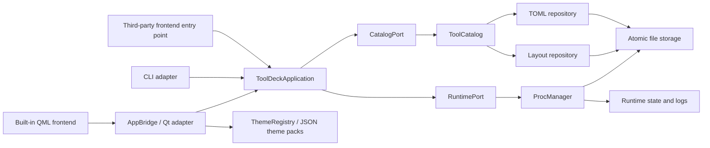

# Lattice Architecture

This document defines ownership, dependency direction, and persistence invariants. The product is Lattice; the `tooldeck` Python package, CLI, data directories, and `ToolDeck` QSettings namespace remain unchanged for compatibility.

## Layers



| Layer | Modules | Ownership |
| --- | --- | --- |
| Domain state | `config.py`, `layout.py`, `procs.py`, `groups.py` | `ToolConfig`, `LayoutState`, `ToolStatus`, raw group keys, validation |
| Application API | `application.py`, `ports.py` | Frontend-neutral commands, queries, protocols, snapshots, and import plans |
| Application services | `catalog.py`, `drafts.py`, `launchers.py` | Cross-file consistency, catalog transactions, draft conversion, launch detection, setup plans, and preflight |
| Infrastructure | `storage.py`, `platform_ops.py`, `telemetry.py`, `tailer.py` | Atomic replacement, OS capabilities, metric sampling, incremental log reads |
| Adapters | `cli.py`, `frontends.py`, `gui/bridge.py`, `gui/tool_model.py` | Discover frontends and translate CLI/Qt input into application calls and output/signals |
| Visual system | `themes.py`, `theme_packs/`, `gui/qml/Theme.qml` | Theme discovery, inheritance, validation, and QML token injection |
| Views | `gui/qml/` | Layout, interaction, and presentation only |

Dependencies follow the arrows inward. Every frontend depends on `ToolDeckApplication`, never directly on `ToolCatalog` or `ProcManager`. QML, CLI, and `AppBridge` do not sequence TOML, `layout.json`, or runtime-state operations themselves.

## Persistence Invariants

- Tool TOMLs own configuration and the raw `group` key. `layout.json` owns group order, tool order, and collapsed state only.
- The empty string is the ungrouped key. The visible “未分组” label is not a key; a custom group with that literal name is disambiguated in presentation.
- File payloads are completed and synced in a same-directory temporary file before atomic replacement. Creation uses an atomic link to prevent overwriting a concurrent creator.
- GUI and CLI share an inter-process catalog lock with a two-second deadline and shutdown cancellation; every mutation reloads the latest snapshot while holding it. A corrupt layout returns `layout_error`: tools remain readable and stoppable, but catalog mutations fail explicitly.
- A mutation spanning TOML and layout writes a `prepared` snapshot to `.catalog-transaction.json`, commits both files, marks the journal `committed`, then removes it.
- Startup restores a `prepared` transaction and only cleans a `committed` transaction, so interruption cannot leave half of a group move.
- `ProcManager` registers a child only after runtime state is durable. A state-write failure terminates the new process tree and records `START-ROLLBACK`.
- An existing corrupt runtime-state file blocks another start because process identity can no longer be proven.

## Application API And Ports

`ToolDeckApplication` is the stable frontend/backend boundary and only accepts or returns plain Python types. Its current `api_version` is `2`. `CatalogPort` and `RuntimePort` are structural protocols, allowing tests, remote proxies, or alternate persistence implementations without inheriting Qt classes.

Application snapshots combine `CatalogSnapshot` and `StatusSnapshot`. Runtime read failures are returned as `RuntimeIssue` values and mark the affected tool as `error`, so stale status is not presented as current. Draft saving, import planning, autostart, active-delete protection, layout moves, and process commands all belong to the facade.

## Launch Detectors And Preflight

`launchers.py` converts a selected file into a declarative `LaunchPlan` and may attach a `SetupPlan` containing only argv commands, working directories, and network markers. Detectors receive no catalog or runtime port and cannot bypass confirmation, disk logging, preflight, or atomic catalog writes through their return value. The application facade exposes `analyze_launch()`, `prepare_environment()`, and `preflight_tool()` for every frontend.

Built-ins cover Python, Shell, PowerShell, BAT/CMD, and native executables. Additional types register through the `tooldeck.launch_detectors` entry-point group with a stable `id`, integer `priority`, and `detect(source, context)` method. Plugin failures are isolated and reported; returned plans still pass through application validation and execution. The executor records incomplete Python setup, so a failed or cancelled attempt yields a resumable plan instead of making a partial environment appear usable. Each detector requires path quoting, Unicode, platform, missing-interpreter, plugin-failure, and blocking-preflight tests.

New `[launch]` tables use argv as execution truth while `cmd` remains a compatibility display value. Selecting raw-command mode removes structured launch data; legacy TOMLs without `[launch]` continue through `cmd + shell`. `[readiness]` probes only loopback HTTP/TCP endpoints. Process lifecycle and readiness are persisted separately so timed-out services remain stoppable and may recover to Ready later.

## Frontend Extensions

The built-in QML UI is only the default adapter. A third-party frontend registers a `tooldeck.frontends` entry point whose callable accepts `ToolDeckApplication` and returns an exit code:

```python
from tooldeck.application import ToolDeckApplication

def run(application: ToolDeckApplication) -> int:
    snapshot = application.refresh()
    # Start a web, TUI, or alternate desktop frontend using application.
    return 0
```

```toml
[project.entry-points."tooldeck.frontends"]
my-ui = "my_package.frontend:run"
```

Use `tooldeck frontends` to inspect discovered adapters and `tooldeck --frontend my-ui` to launch one. Plugins must not import `gui.bridge` or write configuration/runtime files directly.

## Qt And Theme Boundaries

`AppBridge` remains the stable public Qt adapter. It may own selection, timers, QProcess instances, signals, and window lifecycle. Catalog persistence, group transactions, shell command generation, system sampling, and file-manager branching belong to composed services.

With the real runtime, one `ProcessService` thread calls the application facade for catalog I/O, launch analysis, and process commands. Duplicate commands for a pending tool are rejected and status polls are coalesced. `saveToolDraft()` acknowledges queueing; `toolSaveFinished(id, success)` reports persistence, and the editor closes only on success. File analysis uses `requestLaunchDraft()` and `launchDraftReady`; synchronous adapters may call the application API directly.

HTTP/TCP probes use at most four background tasks without holding process locks and commit only to the matching `run_id`. The log service reads up to 64 KiB per request and rejects stale generations after selection or clearing; the view retains at most 2000 rows and 256 KiB characters. Hardware sampling is independent. Environment setup uses a separate task pool and target lock, validates the interpreter through its actual `sys.prefix`, and cancels unfinished work on shutdown.

`themes.py` discovers and validates versioned JSON packs. Built-ins live in `theme_packs/`; user packs live in `~/.config/tooldeck/themes.d/` (or the Windows configuration equivalent). Packs may use `extends`, override selected semantic tokens, and inherit a `shell` that selects the trusted built-in `operations` or `archive` QML layout. Invalid packs are isolated and reported. User packs never load arbitrary QML; `gui/qml/Theme.qml` stores injected tokens but does not own a fixed palette or load files.

```json
{
  "schemaVersion": 1,
  "id": "operator-green",
  "name": "Operator Green",
  "extends": "lattice-day",
  "tokens": {
    "command": "#2f7f53"
  }
}
```

Components use semantic tokens instead of literal colors. The Python `stateColor` role remains for API compatibility, while current QML renders through `Theme.stateColor(state)`.

New work should identify one state owner, call `ToolDeckApplication` from frontends, implement alternate stores/runtimes through ports, isolate platform branches behind injectable functions, add validated theme tokens before styling components, and verify focused tests, full pytest, compileall, qmllint, and Qt screenshots at 1024x700, 1280x800, and a wide viewport.
