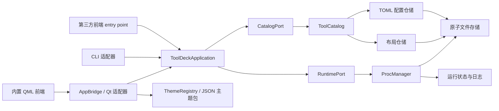

# Lattice 架构

本文定义当前代码的职责边界、持久化不变量和扩展规则。产品名称是 Lattice；为兼容既有安装，Python 包、CLI、配置目录和 QSettings 命名空间继续使用 `tooldeck` / `ToolDeck`。

## 分层与依赖方向



| 层 | 模块 | 只负责 |
| --- | --- | --- |
| 领域状态 | `config.py`、`layout.py`、`procs.py`、`groups.py` | `ToolConfig`、`LayoutState`、`ToolStatus`、原始分组键和校验规则 |
| 应用 API | `application.py`、`ports.py` | 前端无关的命令/查询门面、端口协议、快照和导入规划 |
| 应用服务 | `catalog.py`、`drafts.py`、`launchers.py` | 跨文件一致性、目录事务、草稿转换、启动检测、准备计划和统一预检 |
| 基础设施 | `storage.py`、`platform_ops.py`、`telemetry.py`、`tailer.py` | 原子文件替换、操作系统能力、指标采样和日志增量读取 |
| 适配器 | `cli.py`、`frontends.py`、`gui/bridge.py`、`gui/tool_model.py` | 发现前端，把 CLI/Qt 输入转换为应用 API 调用，并映射输出或 Qt 信号 |
| 视觉系统 | `themes.py`、`theme_packs/`、`gui/qml/Theme.qml` | 主题发现、继承和验证，以及 QML 令牌注入 |
| 视图 | `gui/qml/` | 布局、交互和视觉呈现；不读写配置文件或进程状态 |

依赖只能沿图中箭头向内。所有前端依赖 `ToolDeckApplication`，而不是直接依赖 `ToolCatalog` 或 `ProcManager`。新增配置写入必须经过应用门面；QML、CLI 和 `AppBridge` 不应自行组合 TOML、`layout.json` 与进程状态操作。

## 持久化不变量

- 工具 TOML 拥有工具配置和原始 `group` 键；`layout.json` 只拥有分组顺序、工具顺序和折叠状态。
- 空字符串是未分组键。显示文字“未分组”不是键；字面名称为“未分组”的自定义分组会显示为“未分组（自定义分组）”。
- 所有文件内容先完整写入同目录临时文件、`fsync`，再使用原子替换提交。
- GUI 与 CLI 使用同一个跨进程目录锁；每次变更在锁内重新读取最新快照，避免两个入口交叉覆盖。
- 同时修改工具 TOML 和布局时，`ToolCatalog` 先写 `.catalog-transaction.json` 的 `prepared` 快照，再提交两个文件，最后标记 `committed` 并清理日志。
- 启动时如发现 `prepared` 日志则恢复旧快照；`committed` 日志只需清理。因此进程中断不会留下半次分组移动。
- `ProcManager` 只有在运行状态文件落盘成功后才登记子进程。状态落盘失败会终止新建进程树并记录 `START-ROLLBACK`。
- 已存在但损坏的运行状态文件会阻止再次启动，避免失去身份信息后创建重复进程。

## 应用 API 与端口

`ToolDeckApplication` 是前后端之间的稳定边界，只接收和返回纯 Python 类型。当前 `api_version` 为 `2`。目录和运行时通过 `CatalogPort`、`RuntimePort` 结构协议注入，因此测试、远程代理或替代存储可以实现同一端口，而不需要继承 Qt 类。

应用快照把 `CatalogSnapshot` 与 `StatusSnapshot` 一起返回；状态读取失败会作为 `RuntimeIssue` 返回，并可保留前端提供的上一份状态。保存草稿、导入规划、自动启动、删除运行保护、分组移动和进程命令均由该门面拥有。

## 启动检测器与预检

`launchers.py` 将选中的文件转换成声明式 `LaunchPlan`，并可附带只包含 argv、工作目录和联网标记的 `SetupPlan`。检测器不接收目录仓储或运行时端口，不能通过返回值绕过确认、磁盘日志、预检或原子配置写入。应用门面提供 `analyze_launch()`、`prepare_environment()` 和 `preflight_tool()`；GUI、CLI 与第三方前端必须使用这些入口。

内置检测器覆盖 Python、Shell、PowerShell、BAT/CMD 和本机可执行程序。第三方类型通过 `tooldeck.launch_detectors` entry point 注册，入口对象必须提供稳定的 `id`、整数 `priority` 和 `detect(source, context)`。插件异常会被隔离并报告；所有返回计划仍由应用服务验证和执行。Python 准备由执行器写入不完整标记，失败或取消后检测器只会给出恢复计划，不能把半成品环境当作可用环境。新检测器必须提供路径含空格/Unicode、平台分支、解释器缺失、插件异常和预检阻断测试。

新工具的 `[launch]` 使用 argv 作为执行真值，`cmd` 只保留兼容显示；切换原始命令模式会移除结构化启动信息。没有 `[launch]` 的旧 TOML 继续使用 `cmd + shell`。`[readiness]` 只允许回环 HTTP/TCP 探测；进程生命周期与就绪状态分别持久化，因此启动超时进程仍可安全停止和稍后恢复为就绪。

## 前端扩展

内置 QML 只是默认前端。`tooldeck.frontends` entry point 可注册第三方前端，入口必须是接收 `ToolDeckApplication` 并返回退出码的可调用对象：

```python
from tooldeck.application import ToolDeckApplication

def run(application: ToolDeckApplication) -> int:
    snapshot = application.refresh()
    # 启动 Web、TUI 或另一套桌面 UI，并复用 application。
    return 0
```

```toml
[project.entry-points."tooldeck.frontends"]
my-ui = "my_package.frontend:run"
```

使用 `tooldeck frontends` 查看已发现适配器，使用 `tooldeck --frontend my-ui` 启动。前端插件不得导入 `gui.bridge`，也不得自行写配置或运行状态文件。

## Qt 边界

`AppBridge` 是稳定的公开 Qt 适配器，保留现有属性、信号和槽。它可以维护选择、定时器、QProcess 和窗口生命周期，但不得实现配置仓储、分组事务、Shell 命令生成、系统指标读取或文件管理器分支。

长耗时或平台相关逻辑应放入纯 Python 服务；桥接层只负责调用、错误映射和发射信号。这样 CLI 能复用相同规则，纯逻辑也能在无窗口环境中测试。

## 视觉系统

- `themes.py` 发现并验证带 `schemaVersion` 的 JSON 主题包；内置主题位于 `theme_packs/`，用户主题位于 `~/.config/tooldeck/themes.d/` 或 Windows 对应配置目录。
- `gui/qml/Theme.qml` 只保存当前已注入的语义令牌，不再拥有固定主题。QML 组件不读取 JSON，也不选择主题。
- 主题可用 `extends` 继承现有主题，只覆盖需要变化的令牌；可继承的 `shell` 元数据在受信任的内置 `operations` 与 `archive` QML 壳之间选择布局。
- `themes.d` 不加载任意 QML。用户主题只能选择已注册壳并注入经验证的令牌，因此换布局不会扩大代码执行面。
- 组件使用语义令牌，例如 `telemetry`、`danger`、`consoleText`、`scrim`，不在组件内写十六进制颜色。
- Python 的 `stateColor` 角色仅为兼容旧 QML API；当前视图通过 `Theme.stateColor(state)` 渲染。
- 固定工作台最小尺寸为 1024x700；新增面板必须在最小尺寸、默认 1280x800 和宽屏尺寸下检查裁切与重叠。

最小用户主题可以继承内置主题：

```json
{
  "schemaVersion": 1,
  "id": "operator-green",
  "name": "Operator Green",
  "extends": "lattice-day",
  "tokens": {
    "command": "#2f7f53"
  }
}
```

## 扩展检查表

1. 先确定状态所有者，不在两个文件中重复拥有同一字段。
2. 前端只调用 `ToolDeckApplication`；新的存储或运行时实现对应端口协议。
3. 新平台分支放入基础设施模块并使用可注入边界进行测试。
4. 新颜色或通用尺寸先添加主题令牌和验证规则，再由组件引用。
5. 新前端通过 entry point 接入；新配色通过 JSON 令牌接入；布局级主题先注册受信任 QML 壳，再由 JSON 的 `shell` 字段选择。
6. 新启动类型通过 `tooldeck.launch_detectors` 返回声明式计划，并通过统一预检、确认和准备日志，不能在前端拼接命令或直接安装依赖。
7. 至少运行聚焦测试、完整 `pytest`、`compileall`、`qmllint` 和最小/默认/宽屏 Qt 截图检查。
